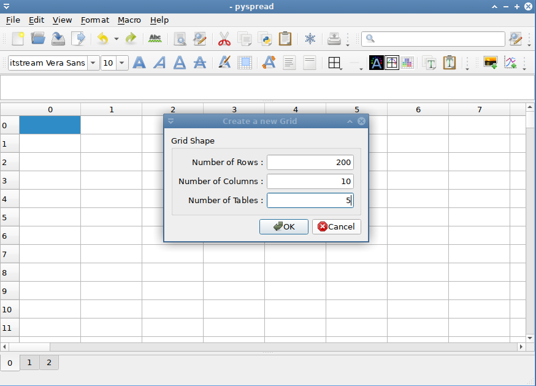
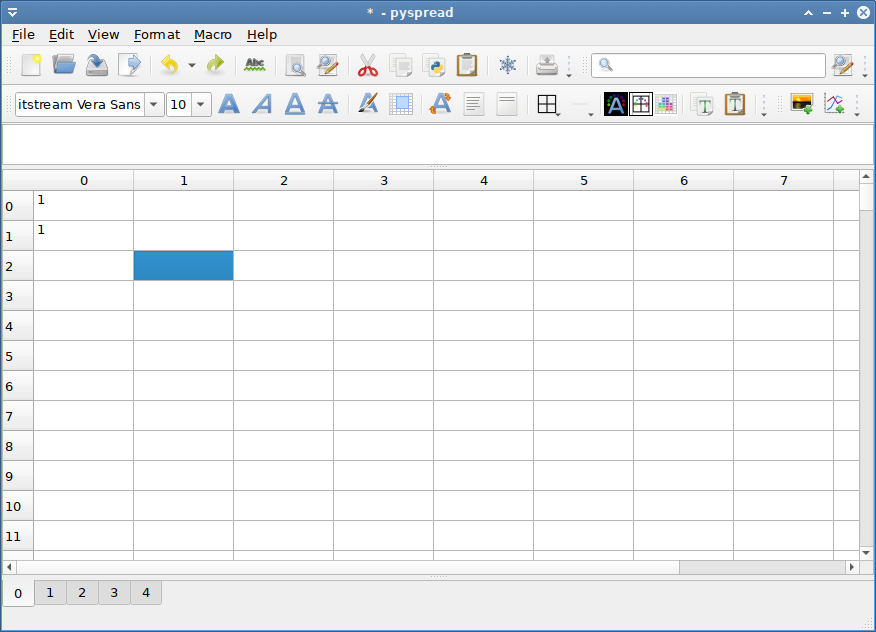

Tutorial
===============


Run pyspread with
```bash
$ pyspread
```

Select the Menu File → New Enter 200 rows, 10 columns and 5 tables in the pop-up menu.



After clicking OK, you get a new table with the typed-in dimensions.

## Standard cell commands

Select the top-left cell and type:
```python
1 + 5 * 2
```

The spreadsheet evaluates this Python statement and displays the result: `11`

In the cell that is one row below (cell (1, 0, 0)), type `S`

As we see from the result, `S` is a known object. In fact, it is the grid object that we are currently working in.

## Absolute addressing of cells

To access a cell, we can index the grid. Replace `S` with

```python
S[0, 0, 0]
```

and the same result as in the top-left cell that has the index (0, 0, 0) is displayed.
- The first index is the row,
- the second parameter is the column
- and the third parameter is the table.

Now replace the expression in the top-left cell by `1`.
Both cells change immediately because all visible cells are updated.



The main grid S can be sliced, too. Write into cell (3, 0, 0): `S[:2, 0, 0]`
It now displays `[1 1]`, which is a list of the results of the cells in `[:2, 0, 0]`.

## Relative addressing of cells

Since cells are addressed via slicing, the cell content behaves similar to absolute addressing in
other spreadsheets. In order to achieve relative addressing, three magic variables X (row), Y (column) and Z (table) are used. These
magic variables correspond to the position of the current cell in the grid.

Change to table 2 by selecting 2 in the iconbar combobox. Type into cell `(1, 2, 2):
```python
[X, Y, Z]
```

The result is `[1 2 2]` as expected. Now copy the cell (Crtl-C) and paste it into
the next lower cell (Ctrl-V). `[2 2 2]` is displayed. Therefore, relative addressing is achieved. Note that if
cells are called from within other cells, the innermost cell is considered the current cell and its position is returned.


## Filling cells

The easiest method for filling cells with sequences is using the X variable.

- Write into cell (1, 1, 2):`X - 1`

Then copy cell (1, 1, 2), select the cells (2, 1, 2) to (99, 1, 2) and paste via <Crtl> + V. Now
the cells (1, 1, 2) to (99, 1, 2) contain consecutive values.


## Named cells

Cells can be named by preceding the Python expression with “<name> =”.

Type into cell (2, 4, 2):
```python
a = 3 * 5
```
and in cell (3, 4, 2):
```python
a ** 2
```

The results 15 and 225 appear. `a` is globally available in all cells.


## External modules

External modules can be imported into pyspread. Therefore, powerful types and manipulation methods are available.

Open the macro panel with `<F4>` and type


```python
from franctions import Fraction
```

Then press  the `Apply` button.

Now we define a rational number object in cell (6, 2, 2) :

```python
p = Fraction("1/37")
```

and in cell (7, 2, 2)

```python
p**2
```

The result 1/1369 appears.


## Working with cells

Summing up cells: The sum function sums up cell values. Enter into cell (16,2,2):
```python
sum(S[1:10, 1, 2])
```
yields `36` as expected.

However, if there are more columns (or tables) to sum up, each row is summed up individually.
Switch to table 1 and enter
 * `1` into cell (0, 0, 1)
 * `2` into cell (1, 0, 1)
 * `3` into cell (0, 1, 1)
 * `4` into cell (1, 1, 1)
 * `sum(S[:2, :2, 1])` into cell (0, 4, 1)

Cell (0, 4, 1) yields `[3 7]`, which may not be intended. If everything shall be summed, the numpy.sum function has to be used:
```python
numpy.sum(S[:2, :2, 1])
```
which yields `10`.


## Plotting

Pyspread renders a plot in any cell that returns a matplotlib figure. Merging the cell with
other cells can increase plot size. In order to make generating plots easier, a chart dialog
has been added to the Macros menu. This chart dialog generates a formula
for the current cell. This formula uses a pyspread specific function that returns a
 matplotlib figure. You can use the object S inside the chart dialog window.

Switch to table 3. Select cell (0,0,3).

Select `Insert chart` from the `Macro` menu.

On the left side, Python code can be edited. On the right side, a chart can be displayed as soon as the code delivers a matplotlib figure in the last line.

In order to make things easier, examples are provided that can be inserted into the editor by clicking on one of the toolbar buttons.

Select the rightmost button (Pie chart) and press the `Apply` button. A pie chart is displayed on the right panel.


Press the `Ok` button. Now the chart appears in cell (0, 0, 3). However, it is tiny. To increase size, select all cells from (0, 0, 3) to (8, 4, 3) and select `Merge cells` from the `Format` menu.
